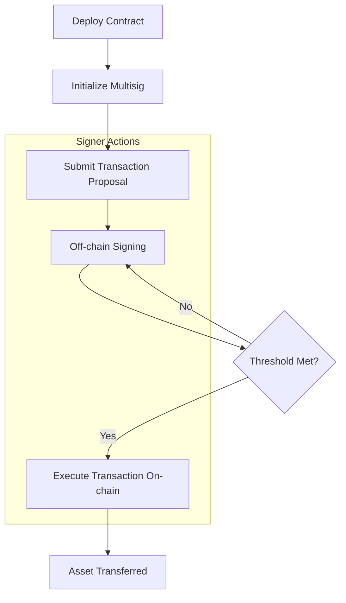

# StacksFort - Secure Multisig Vault on Stacks

StacksFort is a decentralized multi-signature vault platform built on the Stacks blockchain. It enables organizations, DAOs, and teams to securely manage their STX and SIP-010 fungible token assets with flexible threshold signature schemes.


## 🏗️ Interactive Workflow & Guide

To use the vault, you must first **Initialize** it. After that, the standard lifecycle for any asset transfer is: **Submit** → **Sign** → **Execute**.

### 1. The Multisig Lifecycle



### 2. How to Initialize (The First Step)
If you see the message `Multisig not initialized`, you must call the `initialize` function once.

*   **Function**: `initialize(signers-list, threshold-value)`
*   **Parameters**:
    *   `signers-list`: A list of Stacks addresses (principals) who will be the controllers.
    *   `threshold-value`: The minimum number of signers required to approve a transfer (e.g., `2`).
*   **Example**: To set up a 2-of-3 multisig:
    *   `signers-list`: `['SP1..., 'SP2...', 'SP3...']`
    *   `threshold-value`: `u2`
*   **Initial Funds**: You can initialize the vault with zero funds. To add assets later, simply send STX or SIP-010 tokens (like **StacksFort Token**) to the contract address.

### 3. Managing Assets (STX & StacksFort Token)
The vault manages both native STX and SIP-010 tokens (like the included `stacksfort-token`).

#### Transferring STX:
1.  **Submit**: A signer calls `submit-txn` with `txn-type: u0`.
2.  **Sign**: Other signers provide off-chain signatures via the dashboard.
3.  **Execute**: Once the threshold is met, call `execute-stx-transfer-txn`.

#### Transferring StacksFort Token (or any SIP-010):
1.  **Submit**: A signer calls `submit-txn` with `txn-type: u1` and provides the **Token Contract Address** (e.g., `...stacksfort-token`).
2.  **Sign**: Signers approve the proposal off-chain.
3.  **Execute**: Call `execute-token-transfer-txn`. **Crucial**: You must pass the token contract principal as an argument so the vault knows which token to move.

---

## 🔐 Key Features

*   **Multi-Signature Security**: Configure up to 100 signers with custom threshold requirements.
*   **Asset Support**: Native support for **STX** and **SIP-010** fungible tokens.
*   **Off-Chain Signing**: Gas-efficient signing process—pay gas only once during execution.
*   **Security First**: Reentrancy protection and transaction expiration logic.

## 🏗️ Project Structure

```
stacksfort/
├── contract/          # Clarity smart contracts
│   ├── contracts/     # stacksfort-multisig.clar & stacksfort-token.clar
│   └── tests/         # Unit tests
├── frontend/          # Next.js web application
└── README.md          # This file
```

## 🚀 Quick Start

### 1. Smart Contracts
```bash
cd contract
npm install
npm run test        # Run the test suite
```

### 2. Frontend Application
```bash
cd frontend
npm install
npm run dev         # Open http://localhost:3000
```

## 📖 Documentation
*   [Smart Contract Documentation](./contract/README.md)
*   [Frontend Documentation](./frontend/README.md)
*   [Issues & Roadmap](./contract/issues.md)

---
**Authored by: bbkenny <jouleself@gmail.com>**
